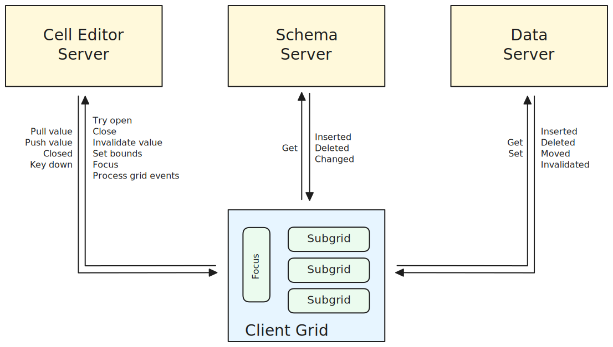

# Client / Server

At the top level, Revgrid has a client/server architecture as shown in the diagram below.

It is important to note that the servers are actually servers and can have multiple clients (ie they are not adapters).  This allows multiple grids to access the same data/schema services.  They will show the same data but with different views.

* Client grid
* Schema server
* Data server
* Cell editor server
