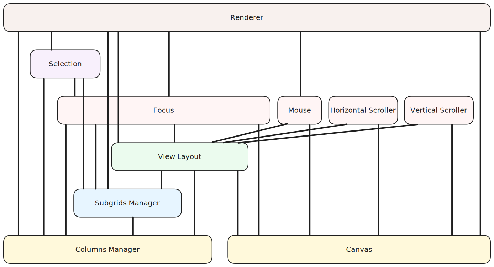

# Client Components

The Client components manage the main resources and constructs used in Revgrid. Each component maintains its state and exposes methods which allow dependent components or behaviors to update its state.  The diagram below shows the dependency between components.  Components are dependent on components below them where linked.

* **[Canvas](./canvas/index.md)**\
ToDo
* **[Columns Manager](./columns-manager/index.md)**\
ToDo
* **[Subgrids Manager](./subgrids-manager/index.md)**\
ToDo
* **[View Layout](./view-layout/index.md)**\
ToDo
* **[Focus](./focus/index.md)**\
Manages cell focus and cell editing within a grid component.
* **[Mouse](./mouse/index.md)**\
ToDo
* **[Scroller (Horizontal & Vertical)](./scroller/index.md)**\
ToDo
* **[Selection](./selection/index.md)**\
Manages selection logic for a grid component.
* **[Renderer](./renderer/index.md)**\
ToDo
