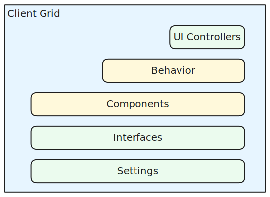

# Client

The main elements that make up the client grid ([RevClientGrid](/revgrid/client/client-grid/RevClientGrid-1/)) are shown in the diagram below

* **[Grid](./grid/index.md)**\
The grid class itself, ([RevClientGrid](/revgrid/client/client-grid/RevClientGrid-1/)), sets up and tears down instances and exposes [behaviors](./behaviors/index.md), [components](./components/index.md) and commonly used parts of their API surface.

* **[UI Controllers](./ui-controllers/index.md)**\
Handles UI events (mainly from [canvas](./components/canvas/index.md)) and updates UI using APIs from [behaviors](./behaviors/index.md) and [components](./components/index.md).

* **[Behaviors](./behaviors/index.md)**\
Provide behavior and APIs that cover more than one component.  Behaviors are generally stateless - nearly all state is maintained in [components](./components/index.md).

* **[Components](./components/index.md)**\
The various parts of the client.

* **[Interfaces](./interfaces.md)**\
Various interfaces used in client, libraries and grids (but not servers).

* **[Settings](../settings/client/index.md)**\
Base interfaces and enumerations for Revgrid settings
