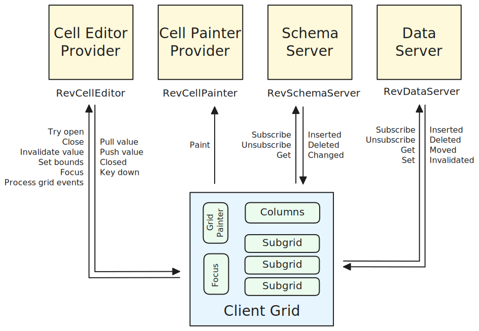

# Client / Server

At the top level, Revgrid has a client/server architecture as shown in the diagram below.

Schema (columns) and data (rows and row values) are supplied to a [client grid](../../client/grid/index.md) via an in-process client / server architecture.  A client grid accesses these [servers](../../servers/index.md) via their respective [`RevSchemaServer`](/common/RevSchemaServer-1/) and [`RevDataServer`](/common/RevDataServer-1/) interfaces.  These servers can serve more than one client grid - each grid will have the same data but can show different views.

A [cell painter](../../cell-painter/index.md) is obtained by a [grid painter](../../client/components/renderer/grid-painters/index.md) from the relevant [subgrid](../../client/components/subgrids/index.md) whenever the grid painter needs to paint a cell. The subgrid itself will obtain the painter via an eventer supplied in the [grid definition](../../client/grid/index.md#definition) when the grid is constructed.  Note that cell painters are shared and do not keep any state themselves.

A [cell editor](../../cell-editor/index.md) is provided to the client grid whenever the [focus component](../../client/components/focus/index.md) attempts to edit a cell.
