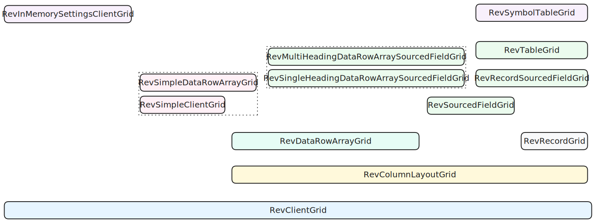

# Grid Classes

The diagram below shows Grid classes within Revgrid:

The colors indicate the module in which the class is declared:
* **blue**: [Client](../../client/index.md)
* **yellow**: [Column Layout](../../servers/column-layout/index.md)
* **grey**: [Record](../../servers/record/index.md)
* **light mint green**: [Data Row Array](../../servers/data-row-array/index.md)
* **green**: [Sourced Field](../../servers/sourced-field/index.md)
* **pink**: [Simple](../../libraries/simple/index.md)
* **purple**: [JavaScript](../../libraries/javascript/index.md)

Grid classes inherit from classes below them in the diagram.  Note that [`RevSourcedFieldGrid`](/revgrid/sourced-field/sourced-field/sourced-field-grid/RevSourcedFieldGrid/) is an interface which is implemented by grid classes above it in the diagram.

## Brief description

* **[`RevClientGrid`](/revgrid/client/client-grid/RevClientGrid-1/)**\
The base grid which draws on the canvas using data supplied from server and handles UI.  All other grid classes are sub classes of RevClientGrid.  This grid class does not include any server code.
* **[`RevColumnLayoutGrid`](/revgrid/column-layout/column-layout-grid/RevColumnLayoutGrid/)** ← *[`RevClientGrid`](/revgrid/client/client-grid/RevClientGrid-1/)*\
Adds behavior to support [column layouts](../../servers/column-layout/index.md).
* **[`RevDataRowArrayGrid`](/revgrid/data-row-array/data-row-array-grid/RevDataRowArrayGrid-1/)** ← *[`RevColumnLayoutGrid`](/revgrid/column-layout/column-layout-grid/RevColumnLayoutGrid/)*\
Uses [Data Row Array](../../servers/data-row-array/index.md) schema server ([`RevDataRowArraySchemaServer`](/revgrid/data-row-array/server/data-row-array-schema-server/RevDataRowArraySchemaServer/)) and data server ([`RevDataRowArrayDataServer`](/revgrid/data-row-array/server/data-row-array-data-server/RevDataRowArrayDataServer/)).
* **[`RevRecordGrid`](/revgrid/record/record-grid/RevRecordGrid-1/)** ← *[`RevColumnLayoutGrid`](/revgrid/column-layout/column-layout-grid/RevColumnLayoutGrid/)*\
Uses [Record](../../servers/record/index.md) schema server ([`RevRecordSchemaServer`](/revgrid/record/server/record-schema-server/RevRecordSchemaServer/)) and data server ([`RevRecordDataServer`](/revgrid/record/server/record-data-server/RevRecordDataServer-1/)).
* **[`RevSourcedFieldGrid`](/revgrid/sourced-field/sourced-field/sourced-field-grid/RevSourcedFieldGrid/)** ← *[`RevColumnLayoutGrid`](/revgrid/column-layout/column-layout-grid/RevColumnLayoutGrid/)*\
`RevSourcedFieldGrid` is an interface which specifies support for allowed fields. All [Sourced Field](../../servers/sourced-field/index.md) grid classes (and their descendants) implement this interface.
* **[`RevRecordSourcedFieldGrid`](/revgrid/sourced-field/record/record/record-sourced-field-grid/RevRecordSourcedFieldGrid/)** ← *[`RevRecordGrid`](/revgrid/record/record-grid/RevRecordGrid-1/)*\
Implements [`RevSourcedFieldGrid`](/revgrid/sourced-field/sourced-field/sourced-field-grid/RevSourcedFieldGrid/) interface.
* **[`RevTableGrid`](/revgrid/sourced-field/record/table/table-grid/RevTableGrid-1/)** ← *[`RevRecordSourcedFieldGrid`](/revgrid/sourced-field/record/record/record-sourced-field-grid/RevRecordSourcedFieldGrid)*\
Uses [Table](../../servers/table/index.md) record store ([`RevTableRecordStore`](/revgrid/sourced-field/record/table/server/table/table-record-store/RevTableRecordStore/)) with [`RevDataSource`](/revgrid/sourced-field/record/table/server/data-source/data-source/RevDataSource-1/) and [`RevTable`](/revgrid/sourced-field/record/table/server/table/table/RevTable-1/).
* **[`RevSingleHeadingDataRowArraySourcedFieldGrid`](/revgrid/sourced-field/data-row-array/single-heading/single-heading-data-row-array-sourced-field-grid/RevSingleHeadingDataRowArraySourcedFieldGrid-1/)** ← *[`RevDataRowArrayGrid`](/revgrid/data-row-array/data-row-array-grid/RevDataRowArrayGrid-1/)*\
A single heading [Data Row Array](../../servers/data-row-array/index.md) grid with built in [definition](../../client/grid/definition/index.md) which creates a [`RevDataRowArraySchemaServer`](/revgrid/data-row-array/server/data-row-array-schema-server/RevDataRowArraySchemaServer/) schema server and 2 subgrids: main and header.  The main subgrid uses [`RevDataRowArrayDataServer`](/revgrid/data-row-array/server/data-row-array-data-server/RevDataRowArrayDataServer/). The header subgrid uses [RevSingleHeadingDataServer](/revgrid/header/server/single-heading/single-heading-data-server/RevSingleHeadingDataServer/). The cell painters used by the subgrids are passed as parameters in the constructor.
* **[`RevMultiHeadingDataRowArraySourcedFieldGrid`](/revgrid/sourced-field/data-row-array/multi-heading/multi-heading-data-row-array-sourced-field-grid/RevMultiHeadingDataRowArraySourcedFieldGrid-1/)** ← *[`RevDataRowArrayGrid`](/revgrid/data-row-array/data-row-array-grid/RevDataRowArrayGrid-1/)*\
A multi heading [Data Row Array](../../servers/data-row-array/index.md) grid with built in [definition](../../client/grid/definition/index.md) which creates a [`RevDataRowArraySchemaServer`](/revgrid/data-row-array/server/data-row-array-schema-server/RevDataRowArraySchemaServer/) schema server and 2 subgrids: main and header.  The main subgrid uses [`RevDataRowArrayDataServer`](/revgrid/data-row-array/server/data-row-array-data-server/RevDataRowArrayDataServer/). The header subgrid uses [`RevMultiHeadingDataServer`](/revgrid/header/server/multi-heading/multi-heading-data-server/RevMultiHeadingDataServer/). The cell painters used by the subgrids are passed as parameters in the constructor.
* **[`RevSimpleClientGrid`](/revgrid/simple/simple-client-grid/RevSimpleClientGrid/)** ← *[`RevClientGrid`](/revgrid/client/client-grid/RevClientGrid-1/)*\
Client grid which uses `Simple` in-memory [grid settings](../../settings/simple/index.md) ([`RevSimpleInMemoryBehavioredGridSettings`](/revgrid/simple/settings-implementations/in-memory/simple-in-memory-behaviored-grid-settings/RevSimpleInMemoryBehavioredGridSettings/), [`RevSimpleInMemoryBehavioredColumnSettings`](/revgrid/simple/settings-implementations/in-memory/simple-in-memory-behaviored-column-settings/RevSimpleInMemoryBehavioredColumnSettings/)).
* **[`RevSimpleDataRowArrayGrid`](/revgrid/simple/simple-data-row-array-grid/RevSimpleDataRowArrayGrid/)** ← *[`RevDataRowArrayGrid`](/revgrid/data-row-array/data-row-array-grid/RevDataRowArrayGrid-1/)*\
A single heading [Data Row Array](../../servers/data-row-array/index.md) grid with built in [definition](../../client/grid/definition/index.md) which creates a [`RevDataRowArraySchemaServer`](/revgrid/data-row-array/server/data-row-array-schema-server/RevDataRowArraySchemaServer/) schema server and 2 subgrids: main and header.  The main subgrid uses [`RevDataRowArrayDataServer`](/revgrid/data-row-array/server/data-row-array-data-server/RevDataRowArrayDataServer/) and [RevSimpleAlphaTextCellPainter](/revgrid/simple/cell-painter/simple-alpha-text-cell-painter/RevSimpleAlphaTextCellPainter-1/). The header subgrid uses [RevSingleHeadingDataServer](/revgrid/header/server/single-heading/single-heading-data-server/RevSingleHeadingDataServer/) and [RevStandardHeaderTextCellPainter](/revgrid/standard/cell-painter/standard-header-text-cell-painter/RevStandardHeaderTextCellPainter-1/). The grid uses `Simple` in-memory [grid settings](../../settings/simple/index.md).
* **[`RevInMemorySettingsClientGrid`](/revgrid/js/in-memory-settings-client-grid/RevInMemorySettingsClientGrid/)** ← *[`RevClientGrid`](/revgrid/client/client-grid/RevClientGrid-1/)*\
A client grid without generic parameters which can be used in JavaScript applications.
* **[`RevSymbolTableGrid`](/revgrid/js/symbol-table-grid/RevSymbolTableGrid/)** ← *[`RevTableGrid`](/revgrid/sourced-field/record/table/table-grid/RevTableGrid-1/)*\
A table grid without generic parameters which can be used in JavaScript applications.
