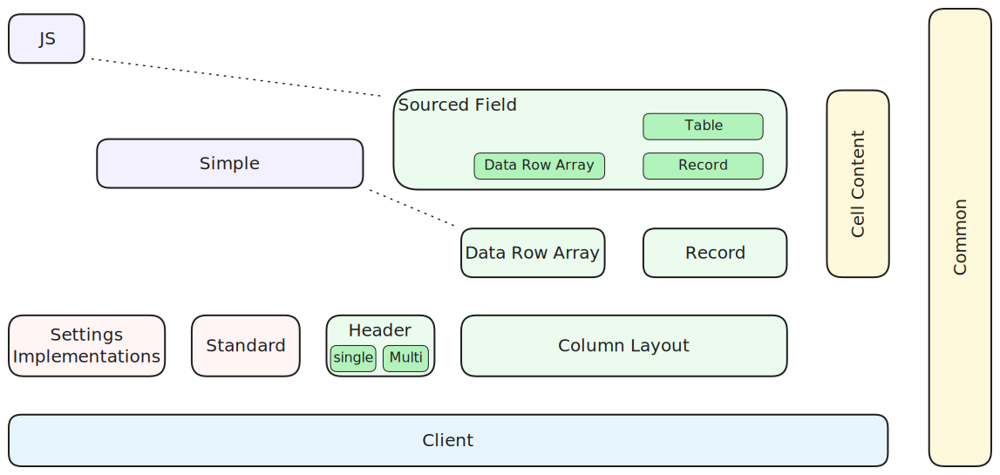

# Modules

The diagram below shows the top level modules within Revgrid:

The colors indicate the type of module:
* **blue**: Client
* **green**: Servers
* **pink**: Libraries that assist with server development
* **purple**: Example grids that combine client and server
* **yellow**: Code common to other modules

The arrangment of modules gives an indication of dependency.  Modules are dependent on those below and the vertical ones on their right.  Dotted lines also show dependencies.

## Brief description

* **[Client](../../client/index.md)**\
Draws the grid on the canvas using data supplied from server and handles UI.
* **[Column Layout](../../servers/column-layout/index.md)**\
Server that maps fields to columns allowing data to ignore column layout.  Also supports serialisation of column layout.
* **[Data Row Array](../../servers/data-row-array/index.md)**\
Server that provides rows of data from a an array of JSON objects. Each object contains the data for one row and all objects need to have the same keys/properties.  Only supports full grid data updates.
* **[Record](../../servers/record/index.md)**\
Server that maps records to rows allowing data to ignore sorting and filtering of rows.  Also supports highlighting recently changes cells and rows.
* **[Sourced Field](../../servers/sourced-field/index.md)**\
Server supports joining fields from multiple sources into records/rows. It also contains a `Table` server which provides infrastructure for generating tables of realtime data for the client based on table definitions.
* **[Header](../../servers/headings/index.md)**\
Server that provides headings to a grid's header [subgrid](../../client/components/subgrids/index.md). Includes 2 servers: one for single row header and the other for multi row header.
* **[Settings Implementation](../../settings/index.md)**\
Provides several implementations for [settings](../../settings/index.md) used in client.  Includes: default, in-memory and readonly implementations.
* **[Standard](../../libraries/standard/index.md)**\
Provides some standard libraries for: painters, [cell painters](../../cell-painter/index.md) and [cell editors](../../cell-editor/index.md) which can be used in servers.  Also includes some specialised classes for managing custom headings and caching table field source definitions.
* **[Simple](../../libraries/simple/index.md)**\
Demonstrates how to create a simple grid which [extends the client settings](../../settings/simple/index.md) that are then used in a custom [cell painter](../../cell-painter/index.md). Includes one grid which just extends the [client grid](../../client/grid/index.md) and another which extends the [Data Row Array](../../servers/data-row-array/index.md) grid.
* **[JS](../../libraries/javascript/index.md)**\
Provides a client grid and a table grid without any generic parameters.  These can be used in JavaScript applications.
* **Common**\
Code common to most modules
* **Cell Content**\
Utility classes and enumerations that assist with generating cell content.

## API

The sidebar on the left shows the API for each of these modules.

